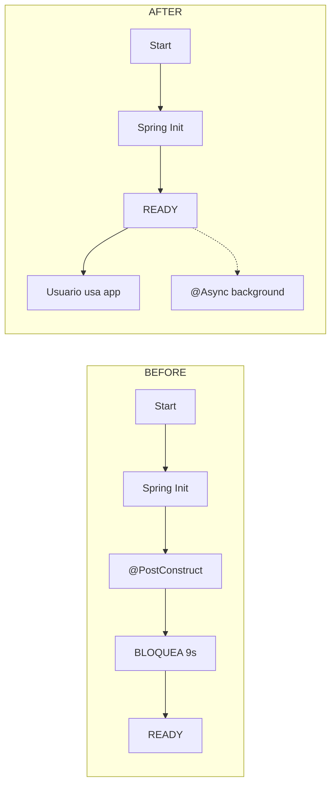

# Startup Timeline - Dia 001

## BEFORE vs AFTER

```mermaid
gantt
    title Cold Start Comparison
    dateFormat X
    axisFormat %Ls

    section BEFORE
    Spring Init           :0, 2000
    Sync API (BLOQUEA)    :crit, 2000, 7000
    Warehouse (BLOQUEA)   :crit, 7000, 10000
    Init BD (BLOQUEA)     :crit, 10000, 11000
    READY                 :milestone, 11000, 0

    section AFTER
    Spring Init           :0, 2000
    READY                 :milestone, done, 2000, 0
    Sync API (background) :active, 2000, 7000
    Warehouse (background):active, 7000, 10000
    Init BD (background)  :active, 10000, 11000
```

## Flujo

```mermaid
flowchart LR
    subgraph BEFORE
        A[Start] --> B[Spring Init]
        B --> C["@PostConstruct"]
        C --> D[BLOQUEA 9s]
        D --> E[READY]
    end

    subgraph AFTER
        F[Start] --> G[Spring Init]
        G --> H[READY]
        H --> I[Usuario usa app]
        H -.-> J["@Async background"]
    end
```

## Metricas

| | ANTES | DESPUES |
|---|---|---|
| Startup | 11s | 2s |
| Mejora | - | 82% |
