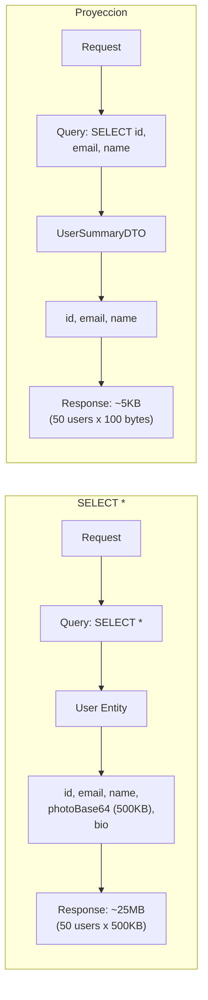
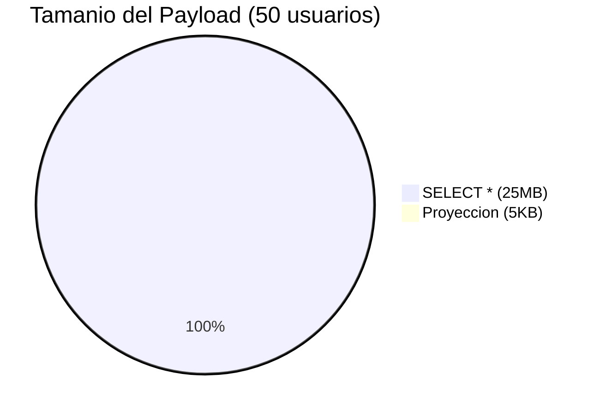

# Comparacion de Payload - Dia 002

## SELECT * vs Proyeccion

## Comparacion de tamanio

## Metricas

| Metrica | SELECT * | Proyeccion | Mejora |
|---------|----------|------------|--------|
| Payload | 25 MB | 5 KB | 99.98% |
| Tiempo BD | ~500ms | ~50ms | 90% |
| Memoria | Alta | Baja | - |
